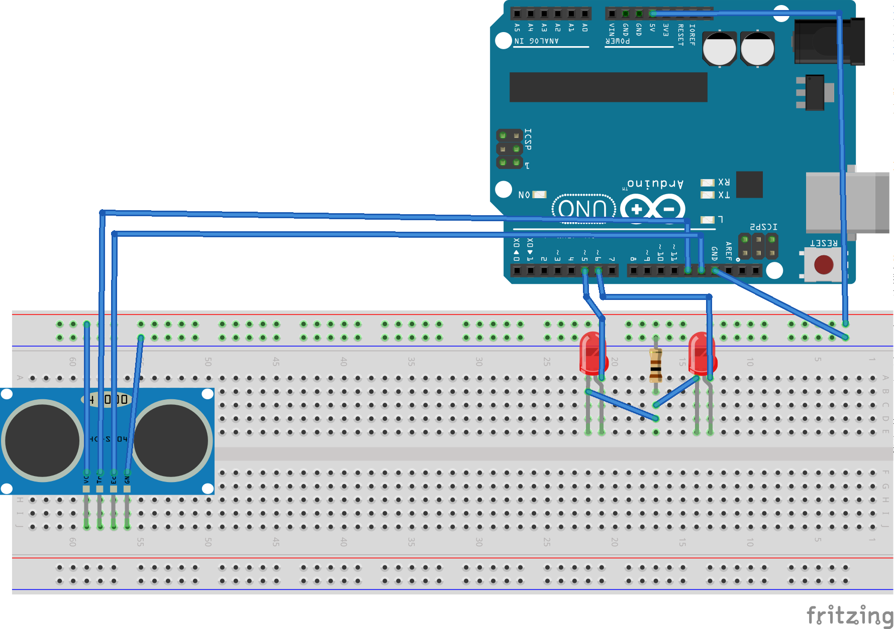

# Halloween Skull

I wanted to create a "scary" Halloween skull as an Arduino project. This is the result.
The two LEDs should be placed in the eyeholes and will light up when someone comes near and then go dark again when they retreat.

This is the setup diagram (thanks to Fritzing):

Unfortunately, I haven't gotten my hands on a cheap hollow plastic skull yet, so there is no photo of the project in action.

### Plans
* Find a plastic skull to put the electronics into and scare the neighbourhood kids.
* Add some screeching sound to make it scarier.

